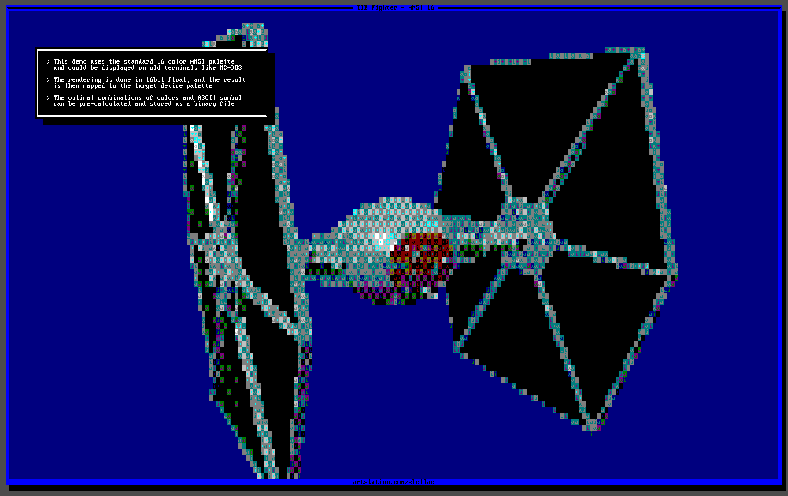
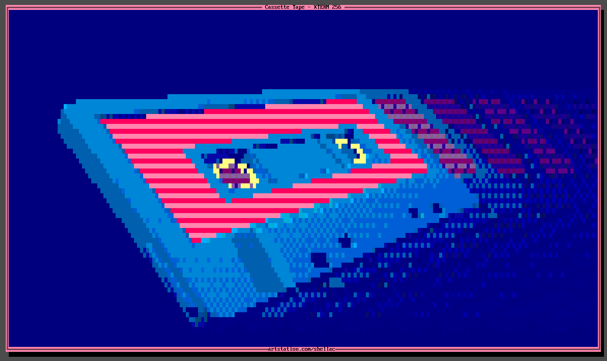
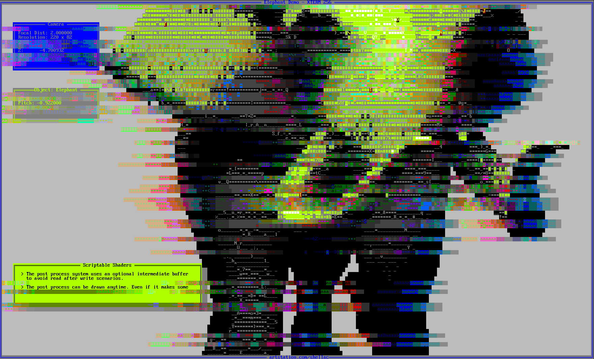
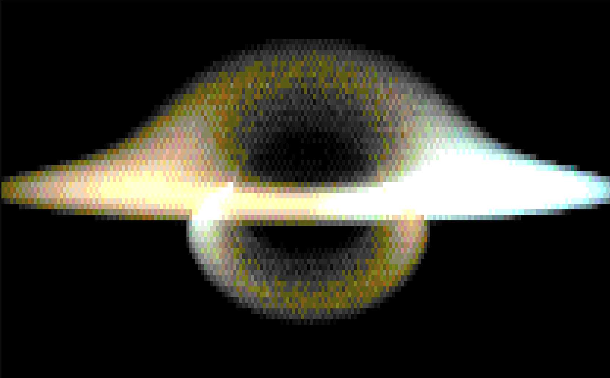

# c99-console-raytracer
A very primitve raytracer that renders directly to the console (Windows only atm).

This is a learning project in C99 with no external dependencies or libraries (other than win32).

- uses a binary volume hierarchy for acceleration
- real time viable for small meshes
- scriptable shaders for surfaces and post processing
- can output to older consoles with ANSI 16 or XTERM 256 palettes.
- supports up to three byte (extended) ASCII characters - for example: ░▒▓█

Some shaders use indexed colors and others generate a full float RGB color which will then be mapped to the final color encoding.
To accelerate the process we can pre-calculate look-up tables on how to best replicate the color with our chosen palette and ASCII characters.

Shaders can be of course mixed an matched

We can also output to XTERM with 256 colors

Raymarching in a post process shader. Based on this [shadertoy](shadertoy.com/view/tX2fR1) but with added Doppler effect.

