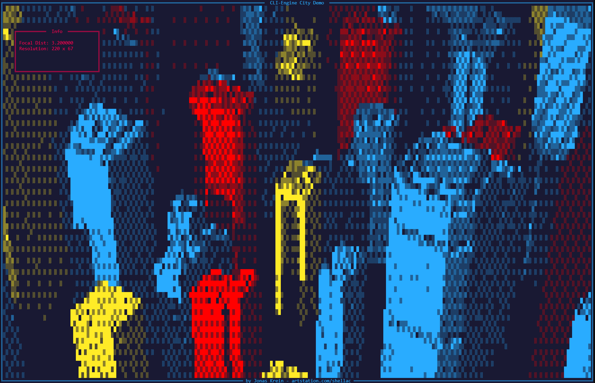
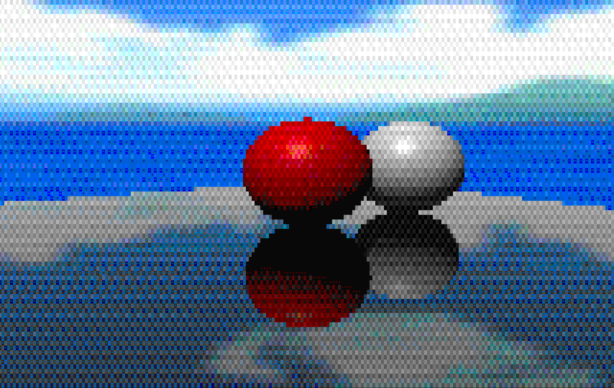

# c99-console-raytracer
Learning project in C99 with no external dependencies or libraries (other than win32)
A very primitve raytracer that renders to the console (Windows only atm).

- uses a binary volume hierarchy for acceleration
- real time viable for small meshes
- scriptable shaders for surfaces and post processing
- can output to older consoles with ANSI 16 or XTERM 256 palettes.

Some shaders draw the final Ascii cell explicitly.

But most shaders generate a RGB color and use a look-up table to convert it. This is often the case when using everything that resamples a pixel, ie. post processing or reflections.

